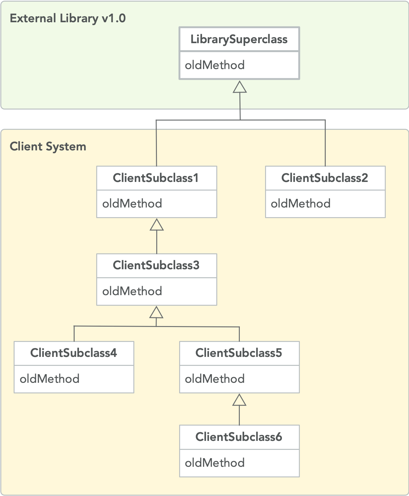
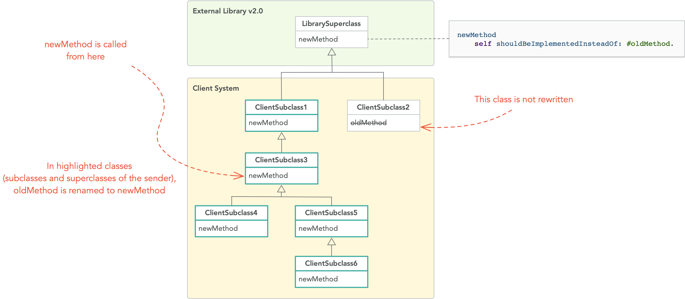

# ShouldBeImplementedInsteadOf


[](https://coveralls.io/github/olekscode/ShouldBeImplementedInsteadOf?branch=master)
[](https://raw.githubusercontent.com/olekscode/ShouldBeImplementedInsteadOf/master/LICENSE)

A prototype warning for Pharo that allows us to automatically rename implementors

## How does it work?

In object-oriented programming it is a common practice for software libraries to provide abstract hooks that should be overriden by clients (see `oldMethod` in the picture below). Another method of the library then calls the hook method and then the correct client's implementation is executed.



However, in a new version, the library can rename the hook from `oldMethod` to `newMethod` (see the picture below). Client systems might not receive any error or deprecation warning but their implementation will never be called.


To prevent this from happening, we propose library developers to replace `self subclassResponsibility` inside their abstract hook with the new message `self shouldBeImplementedInsteadOf: #oldMethod`. This will signal a warning which will try to update the client code and call the right method. Take a look at the example in the picture below. The steps are as follows:

1. `newMethod` is called from `ClientSubclass3`
2. This method is not implemented (instead `ClientSubclass3` implements `oldMethod`) so the implementation from the nearest superclass will be executed. In this case, it's `newMethod` from `LibrarySuperclass`
3. This will signal a warning which will check if `ClientSubclass3` or any of its superclasses until `LibrarySuperclass` implement `oldMethod`. If no, then the warning will be displayed to the client _"You should implement newMethod"_. If yes - then `oldMethod` will be renamed to `newMethod` in `ClientSubclass3`, all its superclasses until `LibrarySuperclass`, and all its subclasses (the highlighted classes in the picture below).
4. Finally, the `newMethod` of `ClientSubclass3` will be called

(all that without interrupting the execution)



## How to install it?

To install `ShouldBeImplementedInsteadOf`, go to the Playground (Ctrl+OW) in your [Pharo](https://pharo.org/) image and execute the following Metacello script (select it and press Do-it button or Ctrl+D):

```Smalltalk
Metacello new
  baseline: 'ShouldBeImplementedInsteadOf';
  repository: 'github://olekscode/ShouldBeImplementedInsteadOf/src';
  load.
```

## How to depend on it?

If you want to add a dependency on `ShouldBeImplementedInsteadOf` to your project, include the following lines into your baseline method:

```Smalltalk
spec
  baseline: 'ShouldBeImplementedInsteadOf'
  with: [ spec repository: 'github://olekscode/ShouldBeImplementedInsteadOf/src' ].
```

If you are new to baselines and Metacello, check out the [Baselines](https://github.com/pharo-open-documentation/pharo-wiki/blob/master/General/Baselines.md) tutorial on Pharo Wiki.
